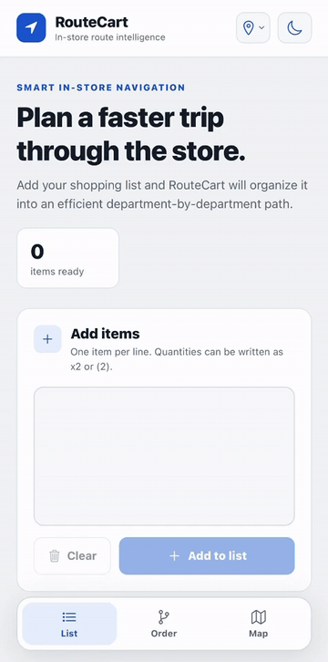

# RouteCart

RouteCart is a mobile in-store shopping route optimization app built with **React Native, Expo, and TypeScript**. It takes a shopping list, classifies each item into a store-specific department, and generates an optimized route through the selected store.

> Personal project. Not affiliated with or endorsed by Walmart.
## Demo



[Watch the full-quality mobile demo](./demo/routecart-demo.mp4)

## Features

- Store-specific routing across multiple Walmart layouts
- Fuzzy item classification for typos and casual input
- Ambiguous-item handling with contextual rules
- Temperature-aware routing for refrigerated and frozen products
- Global route optimization using multiple route seeds, 2-opt, and relocation improvements
- Visual route path with numbered department stops
- Automatic grouping of items from the same department
- Light and dark mode
- Automated regression testing with 400+ classifier and optimizer checks

## Supported Store Layouts

- Walmart Coral Ridge Drive Supercenter
- Walmart Oviedo Deep Lake Rd Supercenter
- Walmart Orlando E Colonial Drive Supercenter

Each store uses its own floor map, department coordinates, entrance/checkout data, and department labels.

## How It Works

```text
Shopping List
     ↓
Item Classification
     ↓
Store Department Mapping
     ↓
Route Optimization
     ↓
Temperature-Aware Scoring
     ↓
Optimized Order + Visual Route
```

### Item Classification

RouteCart normalizes item names and matches them against store-aware department definitions.

The classifier supports:
- exact phrase matching
- singular/plural normalization
- fuzzy typo matching
- compact input such as `icecream`
- contextual rules for ambiguous products

Examples:

```text
"toilet papr"   → Household Paper
"dog shampoo"   → Pets
"AirPods case"  → Electronics
"frozen pizz"   → Frozen
"car wax"       → Auto
```

### Route Optimization

RouteCart groups items by department and searches for an efficient order from the entrance to checkout.

The optimizer uses:
- multiple greedy starting routes
- **2-opt** route improvement
- department relocation passes
- fixed entrance and checkout
- soft penalties for collecting refrigerated and frozen items too early

Cold-item handling is a preference rather than a hard restriction, allowing the optimizer to avoid unnecessary backtracking when the store layout makes another route more efficient.

## Tech Stack

- **React Native**
- **Expo**
- **TypeScript**
- **React Native SVG**
- Custom fuzzy-matching logic
- Custom route-optimization heuristics
- Node test runner with `tsx`

## Automated Testing

RouteCart includes a regression suite with **400+ automated checks** covering:
- cross-store item classification
- typo handling
- ambiguous product behavior
- department grouping
- route improvement
- temperature-aware routing

Run the test suite with:

```bash
npx tsx --test tests/*.test.ts
```

## Run Locally

Install dependencies:

```bash
npm install
```

Run the web version:

```bash
npx expo start --web
```

Run with an Expo development build:

```bash
npx expo start --dev-client --tunnel
```

## Project Structure

```text
RouteCart/
├── App.tsx
├── routecart-classifier.ts
├── routecart-optimizer.ts
├── tests/
│   ├── classifier-regression.test.ts
│   └── optimizer-regression.test.ts
├── assets/
├── app.json
├── package.json
└── README.md
```

## Future Improvements

- Walkable aisle-graph routing instead of direct department-to-department route segments
- More store layouts
- Confidence indicators for uncertain item classifications
- Expanded route-quality benchmarks

## About

Built as a personal software project with a focus on practical optimization, mobile development, and intelligent item classification.
